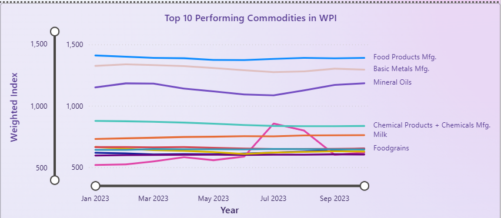
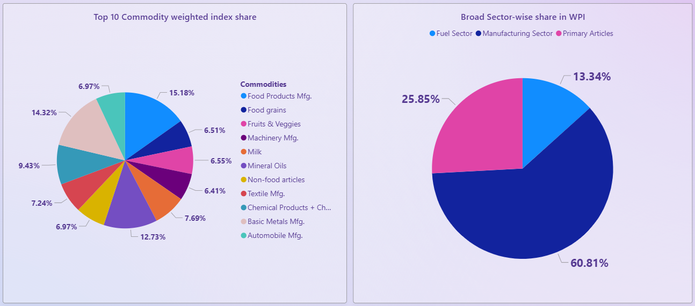
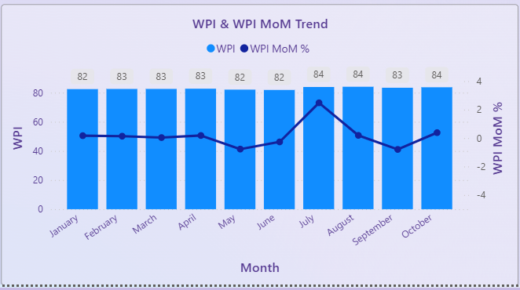
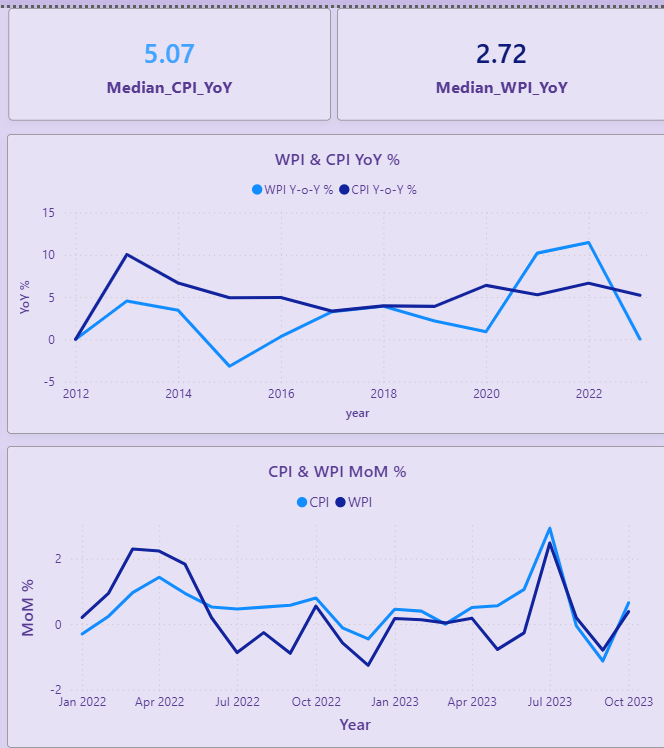
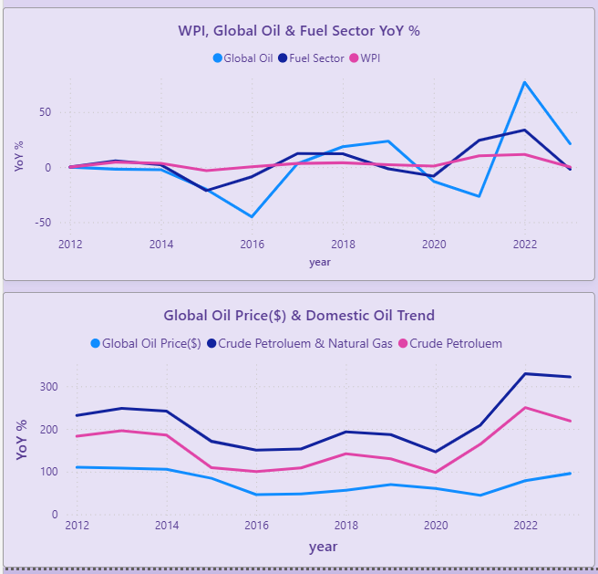
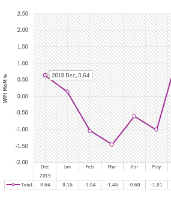
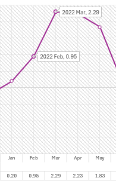
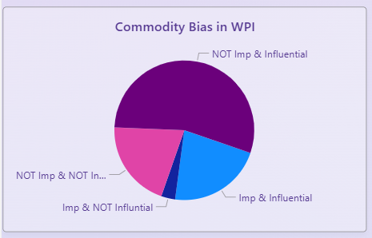
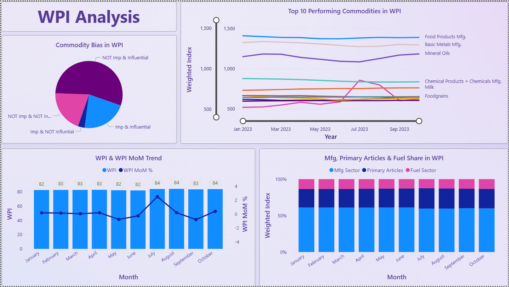

# WPI Case Study - Uncovering wholesale retail inflation in India

## Objective
This project analyzes India’s Wholesale Price Index (WPI) data to understand:
- Which commodities show consistently high inflation  
- which commodities show abnormal volatility  
- Time series trend analysis of WPI itself
- The effect of external events or variables (e.g. CPI, Oil prices) on WPI

The goal is to provide clear and accurate **price insights, MoM and YoY trends** using simple analytical tools.

## Problem Statement
1. Identifying Primary Inflation Drivers for WPI
2. Short to Medium term trend analysis for:
    - Full WPI
    - Manufacturing Category
    - Primary Articles Category
    - Fuel & Power Category
3. Impact of external variables on WPI (specific commodities and as a whole):
    - CPI
    - Global Oil Prices
    - Black Swan Events like Covid 19 & Russia Ukraine war
4. Structure of WPI - is WPI biased towards any commodity(s)?

## Tech Stack & Workflow
| Stages | Tools & Techniques |
|---------|------------------|
|**Data gathering** | govt website - [`Govt of India Datasets`](https://www.data.gov.in/) |
| **Data Cleaning & Prepping** | MySQL + Excel(Power Query and Excel formulae) |
| **EDA** | MySQL(Subqueries, CTE, Joins, Views, Window functions) |
| **Detailed Analysis** | Excel(XLOOKUP, INDEX-MATCH, Formulae, Pivot Tables, Pivot Charts, Power Query) |
| **Visuals** | Power BI (DAX, Power Query, Creating clean visuals) |

## File Links
- Data Sources :
    - [`WPI source data`](data/raw/wpi_govt_data.csv)
    - [`CPI source data`](data/raw/cpi_govt_data.csv)
    - [`oil price data`](data/raw/oil_price_govt_data.xlsx)
- EDA : 
    - [`SQL EDA script`](analysis/anurag_SQL_eda/anurag_SQL_EDA.sql)
    - [`EDA findings`](analysis/anurag_SQL_eda/anurag_sql_eda_findings.pdf)
- Detailed Analysis : [`Excel analysis file`](analysis/anurag_excel_analysis.xlsx)
- Power BI Dashboard : [`Power BI dashboard`](visuals/anurag_dashboard.pbix)

## Findings
|Point of Interest|Finding|
|-----------------|-------|
| 1. Primary Inflation Drivers | Primary Commodity : Food Products Manufacturing |
|  | Primary Category : Manufacturing Sector |
| 2. Short to Medium term trend | While WPI itself remained stable, its MoM growth rate also remained usually in -2% to 2% range in the last 10 months |
| | short spike noticed in July 2023 |
| | can be attributed to sudden increase in Fruit & Veggies prices |
| | Manufacturing sector continued to dominate throughout last 10 months|
| 3. Impact of external variables on WPI | CPI & WPI exhibit strong correlation in MoM basis(between Jan 2022 to Oct 2023) |
| | BUT in YoY trends , CPI & WPI start to diverge |
| | Global Oil Prices have strong correlation with crude petroluem, less with whole fuel sector, and least effect on WPI as a whole |
| | Covid 19: Immediately after Dec 2019, till Mar 2020 there is WPI MoM decline, but later zigzag trend |
| | Russia-Ukraine War : Short term boost to WPI MoM% later again zigzag pattern |
| 4. Structure of WPI as a metric | It is clear that out of 869 commodities, the WPI is biased or prioritises only 183 |

## Data Visualisations
1. **Identifying Primary Inflation Drivers for WPI**

2. **Short to Medium term trend analysis for:**

3. **Impact of external variables on WPI (specific commodities and as a whole):**

4. **Structure of WPI - is WPI biased towards any commodity(s)?**

## Dashboard

